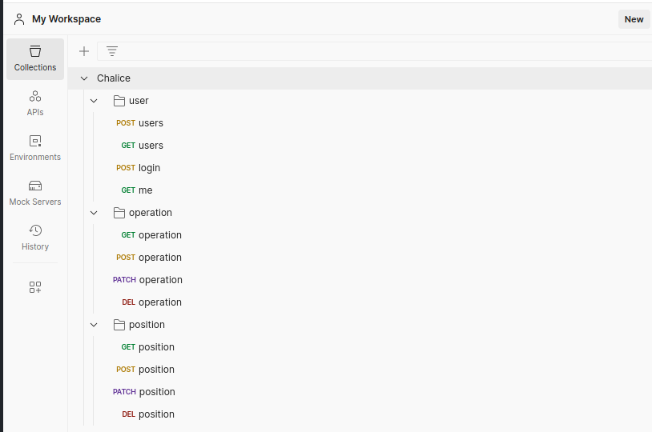

# Model Project for API using AWS Lambda, Chalice, DynamoDB, API Gateway, JWT and Docker

This is a foundational structure designed to create a scalable and high-performance API using Amazon Web Services (AWS) technologies. The API development will be facilitated through Chalice, an open-source AWS framework that simplifies the process of building serverless APIs.

## Key Components

#### AWS Lambda:
A serverless computing service that runs your code without requiring you to provision or manage servers. AWS Lambda will handle the functionality of the API.

#### Chalice:
A Python framework developed by AWS. Chalice facilitates the creation of serverless APIs and microservices, simplifying tasks such as route definition, request and response handling, and integration with other AWS services.

#### AWS DynamoDB:
A highly scalable, high-performance NoSQL database service provided by AWS. DynamoDB will serve as the storage layer to maintain the API data.

#### AWS API Gateway:
A comprehensive service that enables API operations such as creation, deployment, management, security, and monitoring. The API Gateway will serve as the entry point for the API, managing client requests and routing them to the correct Lambda functions.

#### JWT Authentication:
To secure our API, we will incorporate JSON Web Tokens (JWT) as our means of authentication. JWT is an open standard (RFC 7519) that defines a compact and self-contained way for securely transmitting information between parties as a JSON object. This information can be verified and trusted because it is digitally signed.

#### PynamoDB:
A Pythonic interface to DynamoDB that allows for easy interaction with DynamoDB databases. It simplifies CRUD operations and also supports advanced DynamoDB features.

#### Docker:
An open-source technology used for creating, shipping, and running applications. Docker will enable us to package the API and its dependencies, ensuring consistent and error-free deployment.

## Project Objective

The main goal of this project is to create a scalable, serverless API foundation using modern AWS technologies and best practices. The use of JWT for authentication adds an additional layer of security for the API. This project can serve as a blueprint for developing various types of APIs, from RESTful APIs to APIs for integration with different systems and services.

## Final Remarks

This model project acts as a boilerplate for API development that capitalizes on the myriad of resources AWS has to offer. It allows for the development of high availability and robust solutions, enabling developers to focus on crafting innovative applications rather than worry about infrastructure management.

# RUN

## Requirements
- Docker (to run amazon/dynamodb-local)
- Python 3.10
- Packages listed in `requirements.txt`
- [Postman](https://www.postman.com/downloads/) (For API testing)

### Setup
1. Install the necessary packages.
    - If you have pip:
    ```bash
    pip install -r requirements.txt
    ```
    - If you have pipenv:
    ```bash
    pipenv install
    ```

2. Run a local DynamoDB.
    - Set the env variable `DB_HOST` to `http://localhost:8000`


3. Create a config and start chalice.
    - Create a config:
    ```bash
    make config
    ```
    - Start chalice:
    ```bash
    make run
    make chalice
    ```

Now you should be able to test the API on `http://localhost:8010` or run the tests:

### API Testing with Postman
To test the API using Postman, follow these steps:
```
1 - Open Postman.
2 - Click on File > Import....
3 - Select the Chalice.postman_collection.json file from your local directory.
4 - Once the collection is imported, you will see all the endpoints loaded into Postman.
5 - Now you can select any endpoint and click "Send" to run the test.
```

### Clean Up
To stop and cleanup:
```bash
make clean
```


### Manual Deployment
Note: This requires that you have setup the credentials for AWS

DEV
```bash
chalice deploy --stage dev
```


PROD
```bash
chalice deploy --stage prod
```
